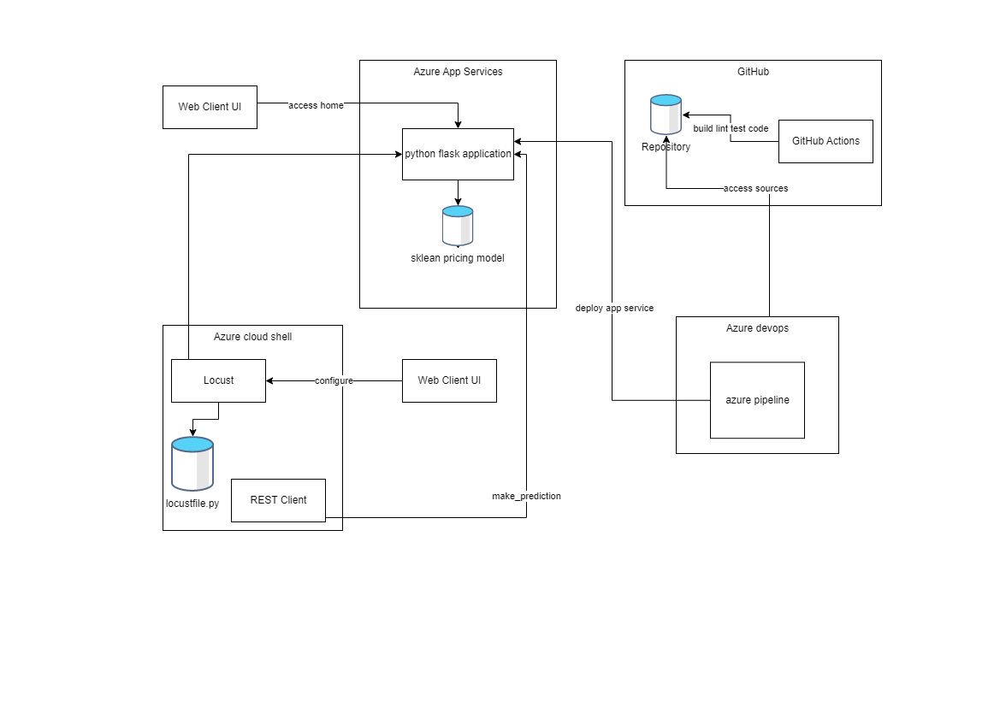
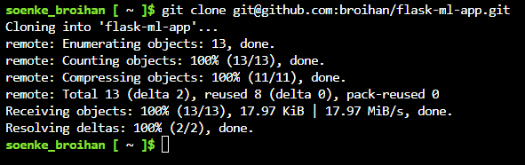

# Overview

This is a python web based machine learning application using flask and sklearn. It's capability is to predict house prices in Bosten depending on provided input variables. 


## Project Plan
The project plan gives you an overview of how the application has evolved and which parts are still open.

Trello board:
* https://trello.com/b/TRtPQ0S3/flask-machine-learning-application

Spreadsheet plan
* [Spreadsheet](project-management.xlsx)

## Instructions



Getting started:

In order to checkout the  project into your azure cloud shell environment you need to generate an ssh key in the cloud shell and upload these keys into your GitHub account.

Afterwards you can simply check out the code through ssh:

```
udacity@Azure:~$ git clone git@github.com:broihan/flask-ml-app.git
```




* Project running on Azure App Service


* Passing tests that are displayed after running the `make all` command from the `Makefile`

* Output of a test run

* Successful deploy of the project in Azure Pipelines.  [Note the official documentation should be referred to and double checked as you setup CI/CD](https://docs.microsoft.com/en-us/azure/devops/pipelines/ecosystems/python-webapp?view=azure-devops).

* Running Azure App Service from Azure Pipelines automatic deployment

* Successful prediction from deployed flask app in Azure Cloud Shell.  [Use this file as a template for the deployed prediction](https://github.com/udacity/nd082-Azure-Cloud-DevOps-Starter-Code/blob/master/C2-AgileDevelopmentwithAzure/project/starter_files/flask-sklearn/make_predict_azure_app.sh).
The output should look similar to this:

```bash
udacity@Azure:~$ ./make_predict_azure_app.sh
Port: 443
{"prediction":[20.35373177134412]}
```

* Output of streamed log files from deployed application

> 

## Enhancements

<TODO: A short description of how to improve the project in the future>

## Demo 

<TODO: Add link Screencast on YouTube>


