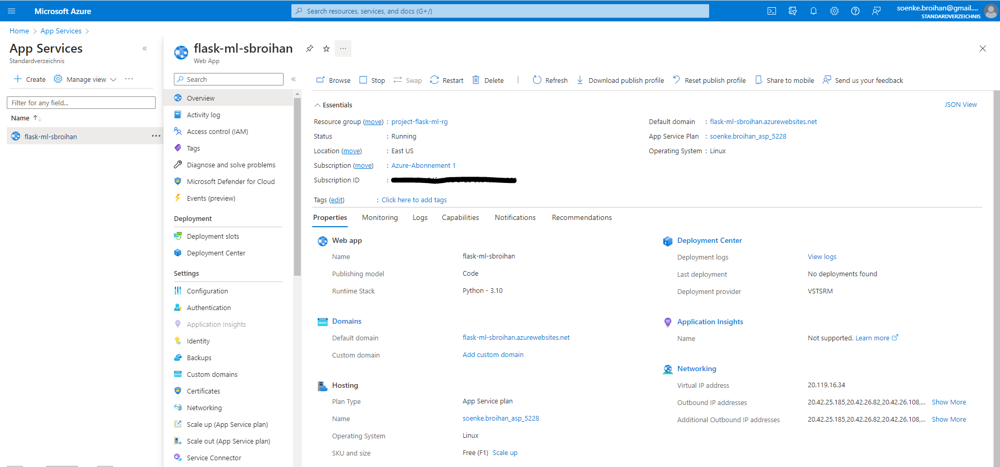
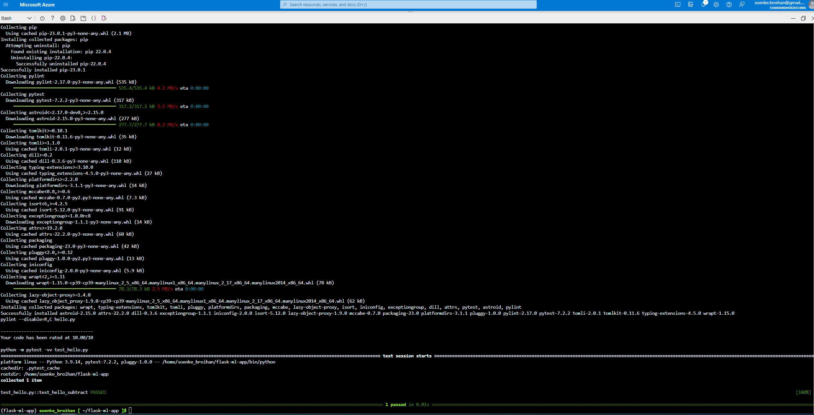
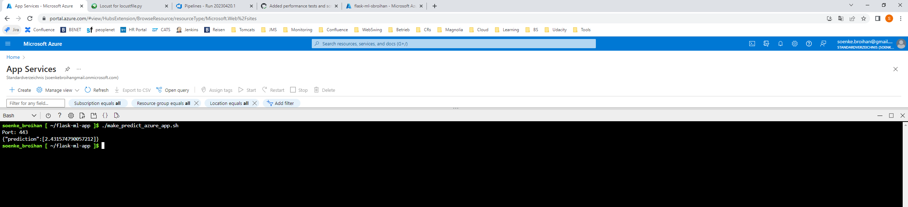
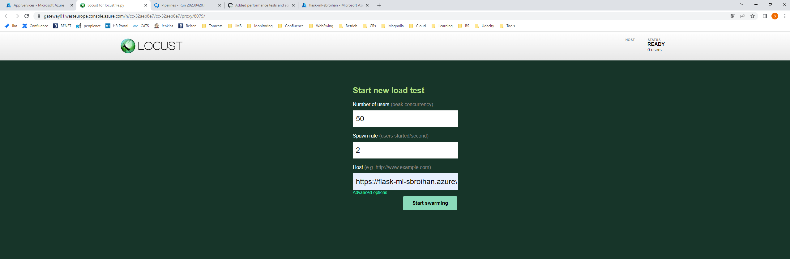
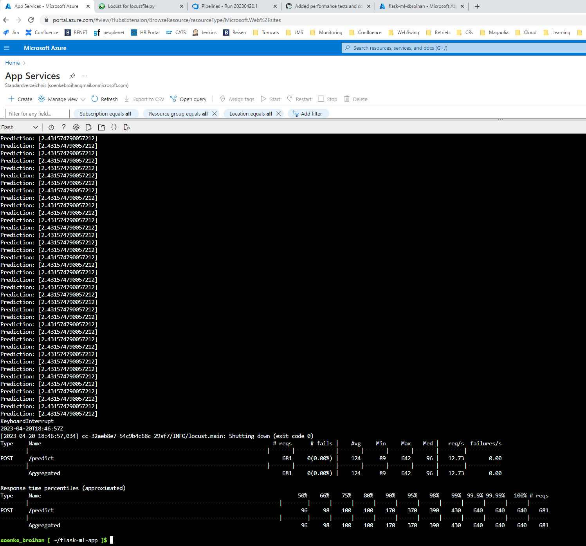
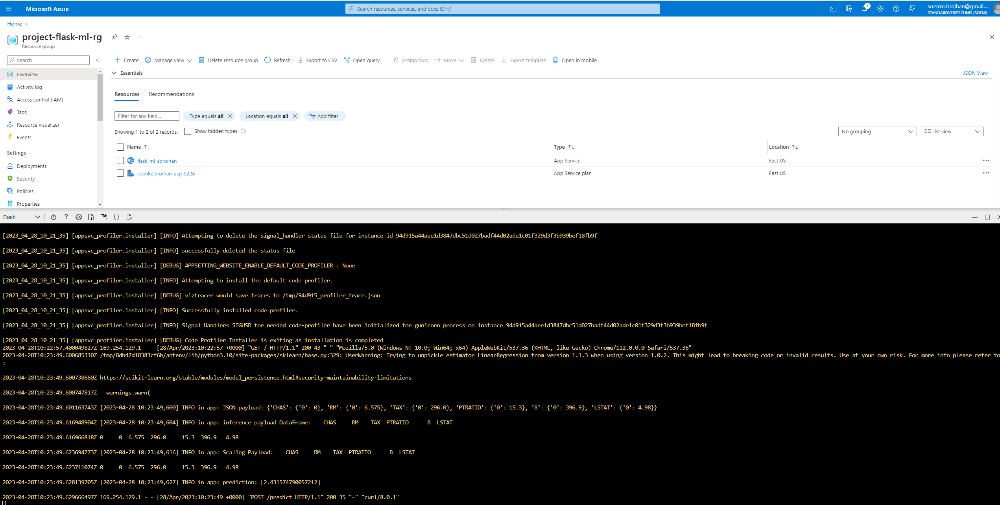
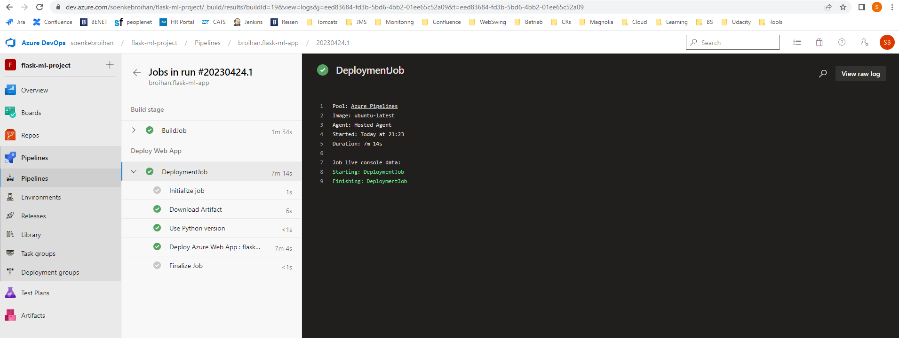

# Overview

This is a python web based machine learning application using flask and sklearn. It's capability is to predict house prices in Bosten depending on provided input variables. 


## Project Plan
The project plan gives you an overview of how the application has evolved and which parts are still open.

Trello board:
* https://trello.com/b/TRtPQ0S3/flask-machine-learning-application

Spreadsheet plan
* [Spreadsheet](project-management.xlsx)


## Instructions


Getting started:

In order to checkout the  project into your azure cloud shell environment you need to generate an ssh key in the cloud shell and upload these keys into your GitHub account.

Afterwards you can simply check out the code through ssh:

```bash
udacity@Azure:~$ git clone git@github.com:broihan/flask-ml-app.git
```


### Project running on Azure App Service

Once the code is cloned you can modify the `commands.sh` file to configure the name of the web application and the resource group it will be deployed in.

```bash
udacity@Azure:~$ vi commands.sh
```

Content of the `commands.sh`:
```bash
#! /bin/bash
az webapp up -n flask-ml-sbroihan -g project-flask-ml-rg --sku f1
```
The `-n` flag sets the name of the web application which must be unique as the web application will be reachable through an URL with the name of the web application. The given resource group (`-g` flag) must already exist.

After running the `commands.sh` script you will find the created web app in your azure portal in the defined resource group:



### Verify local run
You can verify the application can be run locally by invoking the `make all` command from the `Makefile`:



### Remote testing the application
If you have deployed the web app you can test the REST prediction by invoking the shell script in the azure cloud shell `make_predict_azure_app.sh` (you must modify the URL to match your web app name):

```bash
udacity@Azure:~$ ./make_predict_azure_app.sh
```



Also you can setup locust in the azure cloud shell and loadtest the application by running the cmd:
```bash
locust --web-port 8079
```
This will automatically use the locust script from the code `locustfile.py` and expose the Locust web GUI on the port 8079. The GUI then can be accessed using the azure cloud shell web preview like in the screenshot:




The results of the locust loadtest can then be viewed in the azure cloud shell and will look like this:




### Output of streamed log files from deployed application
You can stream the logs of the web up from the cloud shell for debugging reasons using the following command:

```bash
az webapp log tail
```

The output will log like in the following screenshot if you once hit the homepage of the app and afterwards make a rest predict call:




### Azure pipeline deployment
You can easily automate the deployment of the web app using azure DevOps and an azure pipeline. The pipeline is configured by the `azure-pipelines.yml` file in the repository:




## Enhancements
* Enhance the web UI: The web UI is very basic and could be enhanced. It should also be possible to make a prediction from the web UI with available parameters that the user can type in.
* Make it possible to select the underlying prediction model from the REST request
* Add more prediction models to choose from
* Automate the infrastructure setup using terraform
* Support of uploading prediction models and using any custom input parameters


## Demo 

Find a short demo of the project on youtube: https://youtu.be/fGDY2nam1R8


